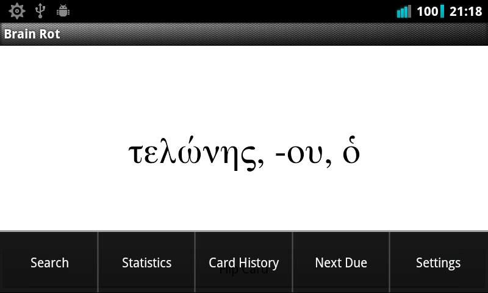

brainrot
========

Android flash card app that reminds user to revise seen cards in decreasing frequency as card moves to long term memory. Written for learning biblical greek/hebrew vocab but importing other cards is supported.

Two .brc (brain rot card) files are included:
* smallvocabset.brc is a sample file of 10 cards from metzgervocab.brc
* metzgervocab.brc is metzger's vocabulary by frequency set (1067 words)

Hopefully these will give you an idea of the application:

   

Options
==
It is also possible to review cards recently seen

And manually set the rank of a card (i.e. tell Brain Rot that you know this card already)

